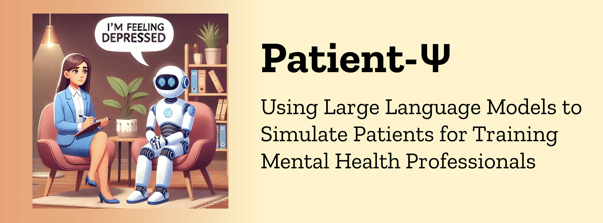

<div style="width: 100%;">
  </img>
</div>

# Patient-Ψ: Using Large Language Models to Simulate Patients for Training Mental Health Professionals
[](https://arxiv.org/pdf/2405.19660) []() [](https://www.python.org/downloads/release/python-3109/) []() [](https://www.apache.org/licenses/LICENSE-2.0)

## 📌 Table of Contents
- [Get started on local computer](#get-started-on-local-computer)
  - [Install](#install)
  - [Set up Vercel app](#set-up-vercel-app)
- [Quickly start the Patient-Ψ-Trainer](#quickly-start-the-patient-ψ-trainer)
- [Cognitive model generation - Patient-Ψ-CM dataset](#cognitive-model-generation---patient-ψ-cm-dataset)
- [Prompts for Patient-Ψ](#prompts-for-patient-ψ)
- [Citation](#citation)

## Get started on local computer

### Install

We recommend starting a virtual environment with miniconda ([quick command line installation](https://docs.anaconda.com/miniconda/#quick-command-line-install)):

```bash
conda create -n patient-psi python=3.11.0
```

Then install requirements for python3 and for Next.js-based [Vercel app](https://vercel.com/).

```bash
# Python packages
pip install -r requirements.txt

# Next.js dependencies
conda install -c conda-forge nodejs
npm install -g pnpm@8.7.4
npn install -g ts-node
npm install -g vercel
```

### Set up Vercel app

First, create a Vercel account via the [Vercel website](https://vercel.com/).

Then, fork this repo, and create a Vercel project and a KV database linked to it. Follow the video clip for instructions.

[](https://www.youtube.com/watch?v=HkmghKHsQgU)

After this, go back to the terminal. Run `vercel link` and fill in the credentials to connect to the Vercel project just created. 

Under your forked repo, run the following to create a `.env.local` file with automatically imported environment variables of the KV database.
```bash
vercel env pull .env.local
```
You need to add two additional environment variables to the `.env.local` file manually. We provide an example at `.env.example`.

- `AUTH_SECRET`: use either `openssl rand -base64 32` or an [automatic generator](https://generate-secret.vercel.app/32) to generate a random secret.
- `OPENAI_API_KEY`: plug in your OpenAI API key.

Run the following commands under your forked repo to update the additional environment variables to the Vercel project settings. The Vercel app will prompt you to fill out the corresponding values and ask you to select the environments to add to. Please toggle all environments (production, development, preview).
```bash
vercel env add AUTH_SECRET
vercel env add OPENAI_API_KEY
```
To check if the above setup is successful, go to your Vercel project page, and navigate to `Settings -> Environment Variables`, and there should be at least 6 key-value pairs as shown in `.env.example`.

> Note: You should not commit your `.env` file anywhere.

## Quickly start the Patient-Ψ-Trainer
After setting up the Vercel app, you can quickly upload sample cognitive models to the KV database and start the Patient-Ψ-Trainer powered by GPT-4. 

We provide example patient cognitive models in file `python/data/profiles.json`, which are publically available on [Beck Institute website](https://beckinstitute.org/wp-content/uploads/2021/08/Abes-CCD.pdf).

First, upload the profiles to your KV database by running the code.
```bash
ts-node lib/utils/kvDatabaseFunctions.ts 
```
Second, run the following to start the server on `localhost:8001`.
```bash
pnpm install
pnpm dev --port 8001
```
The app should be started on [http://localhost:8001/signup](http://localhost:8001/signup). Please sign up with any 6 characters at minimum.

## Cognitive model generation - Patient-Ψ-CM dataset
**To get access to the Patient-Ψ-CM dataset, please fill out this form: https://forms.gle/pQ3g6YVFrEWjBU2H7.**

Folder `python/` contains the code for producing the Patient-Ψ-CM dataset. We provide an example transcript excerpt from CBT therapy, which is publicly available on [Beck Institute website](https://beckinstitute.org/beck-institute-role-play-transcript-abe-therapy-session-2/). 

Run the following commands to construct the cognitive models. Make sure you update the `OPENAI_API_KEY` in `python/.env` 
```bash
cd python
python3 -m generation.generate --transcript-file "example_transcript.txt" --out-file "example_CCD_from_transcript.json"
```

> Note: You should not commit you `.env` file anywhere. Make sure to update the variables in `python/.env` if you want to use your custom folder.

## Prompts for Patient-Ψ
The prompts for different conversational styles can be found in [this folder](https://github.com/ruiyiw/patient-psi/tree/main/app/api/data)

The prompts for simulating a patient with a cognitive model can be found in [this function](https://github.com/ruiyiw/patient-psi/blob/284444a1a8649dbe514aa191c4592c7cc6812bd3/app/api/getDataFromKV.ts#L147)

## Citation
```bibtex
@inproceedings{wang-etal-2024-patient,
    title = "{PATIENT}-$\psi$: Using Large Language Models to Simulate Patients for Training Mental Health Professionals",
    author = "Wang, Ruiyi  and
      Milani, Stephanie  and
      Chiu, Jamie C.  and
      Zhi, Jiayin  and
      Eack, Shaun M.  and
      Labrum, Travis  and
      Murphy, Samuel M  and
      Jones, Nev  and
      Hardy, Kate V  and
      Shen, Hong  and
      Fang, Fei  and
      Chen, Zhiyu",
    editor = "Al-Onaizan, Yaser  and
      Bansal, Mohit  and
      Chen, Yun-Nung",
    booktitle = "Proceedings of the 2024 Conference on Empirical Methods in Natural Language Processing",
    month = nov,
    year = "2024",
    address = "Miami, Florida, USA",
    publisher = "Association for Computational Linguistics",
    url = "https://aclanthology.org/2024.emnlp-main.711",
    pages = "12772--12797",
}
```
